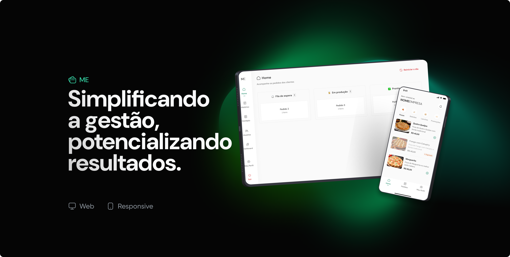

# PUCRS - Pós Graduação em Desenvolvimento Full Stack - Projeto de conclusão de curso

# TCC - Sistema de Pedidos para Restaurantes e Bares


📅 Projeto em desenvolvimento — Última atualização: junho de 2025

📚 Documentação completa → [Veja aqui](./docs/index.md)

## 📚 Sumário

- [PUCRS - Pós Graduação em Desenvolvimento Full Stack - Projeto de conclusão de curso](#pucrs---pós-graduação-em-desenvolvimento-full-stack---projeto-de-conclusão-de-curso)
- [TCC - Sistema de Pedidos para Restaurantes e Bares](#tcc---sistema-de-pedidos-para-restaurantes-e-bares)
  - [📚 Sumário](#-sumário)
  - [📌 Visão Geral](#-visão-geral)
  - [🚀 Tecnologias Utilizadas](#-tecnologias-utilizadas)
    - [**Backend**](#backend)
    - [**Frontend (Versão Web - Administração)**](#frontend-versão-web---administração)
    - [**Mobile (Versão para Garçom)**](#mobile-versão-para-garçom)
  - [🛠️ Como Rodar o Projeto](#️-como-rodar-o-projeto)
    - [**Pré-requisitos**](#pré-requisitos)
    - [**Passos para Rodar o Backend**](#passos-para-rodar-o-backend)
    - [**Passos para Rodar o Frontend (Administração)**](#passos-para-rodar-o-frontend-administração)
    - [**Passos para Rodar o Mobile (Garçom)**](#passos-para-rodar-o-mobile-garçom)
  - [📡 Principais Endpoints da API](#-principais-endpoints-da-api)
  - [📌 Fluxo do Sistema](#-fluxo-do-sistema)
  - [🎯 Contribuição](#-contribuição)
  - [📄 Licença](#-licença)
  - [📞 Contato](#-contato)
 
## 📌 Visão Geral
O projeto é um sistema para gerenciamento de pedidos em restaurantes e bares, substituindo as tradicionais comandas de papel. O sistema facilita a comunicação entre garçons e a cozinha, otimizando o atendimento e melhorando a organização dos pedidos.

## 🚀 Tecnologias Utilizadas
### **Backend**
- **Linguagem:** TypeScript
- **Framework:** NestJS
- **Banco de Dados:** PostgreSQL (Neon)
- **ORM:** Prisma
- **Autenticação:** JWT
- **Comunicação em Tempo Real:** WebSockets (Socket.io)
- **Upload de Imagens:** Cloudinary
- **Processamento de Upload:** Multer, Sharp
- **Requisições HTTP:** Axios (para interagir com APIs externas)
- **Validação de Dados:** Zod
- **Testes:** Jest
- **DevOps:** Docker, GitHub Actions
- **Hospedagem:** Render

### **Frontend (Versão Web - Administração)**
- **Linguagem:** TypeScript
- **Framework:** Next.js
- **Estilização:** Tailwind CSS
- **Gerenciamento de Estado:** Zustand
- **Autenticação:** JWT
- **Requisições HTTP:** Axios
- **Tela de Login:** Implementada para que apenas administradores cadastrados possam acessar o sistema
- **Hospedagem:** Vercel

### **Mobile (Versão para Garçom)**
- **Linguagem:** TypeScript
- **Framework:** React Native
- **Navegação:** React Navigation
- **Gerenciamento de Estado:** Zustand
- **Autenticação:** JWT
- **Tela de Login:** Implementada para que apenas garçons cadastrados possam acessar o sistema
- **Comunicação em Tempo Real:** WebSockets
- **Notificações Push:** Expo Notifications (FCM)
- **Distribuição:** Arquivo APK no site

## 🛠️ Como Rodar o Projeto
### **Pré-requisitos**
| Ferramenta | Versão mínima           | Observações                                            |
| ---------- | ----------------------- | ------------------------------------------------------ |
| Node.js    | 18.x ou superior        | Download                                               |
| Yarn       | 1.22.x ou superior      | Instalação                                             |
| Docker     | 20.x ou superior        | Usado para rodar o banco de dados localmente           |
| Git        | Qualquer versão estável | Para clonar o repositório                              |
| NestJS CLI | 10.x ou superior        | npm i -g @nestjs/cli                                   |
| PostgreSQL |                         | Utilizado via Docker (não precisa instalar localmente) |

### **Passos para Rodar o Backend**
```sh
# Clone o repositório
git clone https://github.com/ana-ferreiramg/PUCRS_TCC.git
cd PUCRS_TCC/api

# Instale as dependências
yarn install

# Configure as variáveis de ambiente
cp .env.example .env

# Execute as migrações do banco de dados
npx prisma migrate dev

# Inicie o servidor
yarn start
```

### **Passos para Rodar o Frontend (Administração)**
```sh
cd ../frontend

# Instale as dependências
yarn install

# Configure as variáveis de ambiente
cp .env.example .env

# Inicie o servidor local
yarn dev
```

### **Passos para Rodar o Mobile (Garçom)**
```sh
cd ../mobile

# Instale as dependências
yarn install

# Inicie o Expo
yarn start
```

## 📡 Principais Endpoints da API
| Método | Endpoint     | Descrição                                   |
| ------ | ------------ | ------------------------------------------- |
| POST   | /auth/signup | Criação de conta do administrador (empresa) |
| POST   | /auth/login  | Autenticação do usuário                     |
| POST   | /users       | Cadastro de garçons pela empresa            |
| GET    | /orders      | Listagem de pedidos                         |
| POST   | /orders      | Criação de um novo pedido                   |
| PATCH  | /orders/:id  | Atualização do status do pedido             |
| DELETE | /orders/:id  | Exclusão de um pedido                       |  |

🔐 Autenticação
| Método | Endpoint     | Descrição                                                                      |
| ------ | ------------ | ------------------------------------------------------------------------------ |
| POST   | /auth/signup | Criação de conta do administrador (empresa) e cadastro de garçons pela empresa |
| POST   | /auth/login  | Autenticação de usuário (ADMIN, SUPER_ADMIN, WAITER)                           |  |

🧑‍🍳 Garçons
| Método | Endpoint   | Descrição                      |
| ------ | ---------- | ------------------------------ |
| GET    | /users     | Listagem de garçons da empresa |
| GET    | /users/:id | Buscar garçom por ID           |
| PATCH  | /users/:id | Atualizar dados de um garçom   |
| DELETE | /users/:id | Excluir garçom                 |  |

📦 Produtos
| Método | Endpoint      | Descrição                               |
| ------ | ------------- | --------------------------------------- |
| POST   | /products     | Cadastro de produto (com ou sem imagem) |
| GET    | /products     | Listagem de produtos                    |
| GET    | /products/:id | Detalhes de um produto                  |
| PATCH  | /products/:id | Atualização de dados ou imagem          |
| DELETE | /products/:id | Exclusão de produto                     |  |

🧩 Categorias
| Método | Endpoint        | Descrição                       |
| ------ | --------------- | ------------------------------- |
| POST   | /categories     | Criação de uma nova categoria   |
| GET    | /categories     | Listagem de todas as categorias |
| GET    | /categories/:id | Busca de uma categoria por ID   |
| PATCH  | /categories/:id | Atualização de uma categoria    |
| DELETE | /categories/:id | Exclusão de uma categoria       |  |

📋 Pedidos
| Método | Endpoint    | Descrição                                            |
| ------ | ----------- | ---------------------------------------------------- |
| GET    | /orders     | Listagem de pedidos                                  |
| POST   | /orders     | Criação de um novo pedido com itens                  |
| PATCH  | /orders/:id | Atualização do status do pedido (cozinha/admin)      |
| DELETE | /orders/:id | Exclusão de pedido (se ainda não estiver finalizado) |

🏢 Empresas
| Método | Endpoint       | Descrição                                              |
| ------ | -------------- | ------------------------------------------------------ |
| POST   | /companies     | Criação manual de empresa (uso interno, se necessário) |
| GET    | /companies     | Listagem de empresas (admin)                           |
| GET    | /companies/:id | Detalhes de uma empresa                                |
| PATCH  | /companies/:id | Atualização dos dados da empresa                       |
| DELETE | /companies/:id | Exclusão de empresa (admin only)                       |  |

## 📌 Fluxo do Sistema
1. Criação da Conta da Empresa
O administrador (dono do bar/restaurante) cria uma conta através da rota /auth/signup, registrando os dados da empresa e sendo automaticamente vinculado a ela como ADMIN.
2 .Cadastro dos Garçons
Acessando o painel web, o administrador cadastra os garçons via /waiters. Cada garçom recebe suas credenciais para acessar o sistema pelo app mobile.
3. Login no Sistema
Tanto administradores quanto garçons realizam login via /auth/login, recebendo um token JWT para autenticação nas próximas requisições.
4. Registro de Pedidos (App Mobile)
Os garçons utilizam o aplicativo mobile para realizar pedidos. Ao finalizar a escolha dos itens, o pedido é enviado via /orders contendo os produtos e quantidades.
5. Persistência dos Pedidos no Backend
A API recebe os dados do pedido, calcula o total e armazena todas as informações no banco de dados utilizando o Prisma.
6. Envio em Tempo Real para a Cozinha (WebSockets)
Assim que o pedido é criado, a API emite um evento via WebSocket (socket.io) notificando a cozinha/admin em tempo real sobre o novo pedido.
7. Visualização e Gerenciamento na Versão Web
O painel web exibe todos os pedidos em tempo real para o administrador/cozinha, mostrando o status de cada um deles.
8. Atualização do Status do Pedido
A cozinha pode alterar o status do pedido para Em preparo, Finalizado ou Cancelado via /orders/:id. Essa mudança também é emitida em tempo real via WebSocket.
9. Notificação ao Garçom (App Mobile)
O garçom recebe notificações no app indicando que o pedido foi finalizado ou cancelado, e pode então entregá-lo ao cliente.
10. Ciclo de Atendimento Concluído
O pedido é considerado finalizado quando entregue, podendo futuramente ser integrado com um fluxo de pagamento ou fechamento de conta.

## 🎯 Contribuição
Se deseja contribuir para o projeto, siga os seguintes passos:
1. Faça um fork do repositório.
2. Crie uma nova branch (`git checkout -b minha-feature`).
3. Commit suas mudanças (`git commit -m 'Adicionando nova feature'`).
4. Faça push da branch (`git push origin minha-feature`).
5. Abra um Pull Request.

## 📄 Licença
Este projeto está sob a licença MIT. Veja o arquivo `LICENSE` para mais detalhes.

## 📞 Contato
- Email: anapaulaferreiradev@gmail.com
- LinkedIn: [linkedin.com/in/ana--ferreira](https://linkedin.com/in/ana--ferreira)

---

