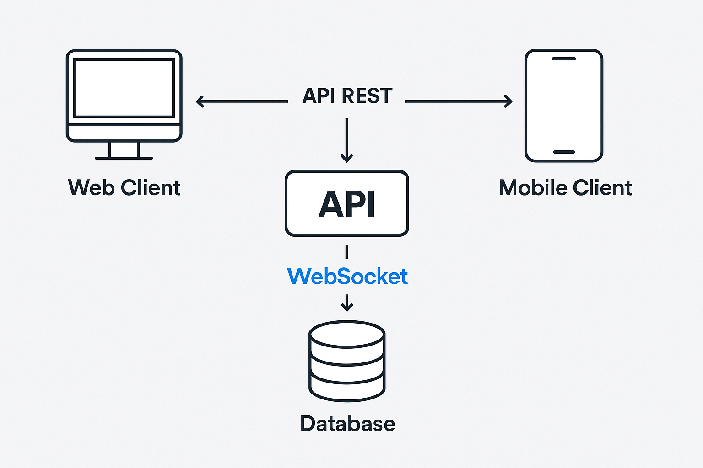
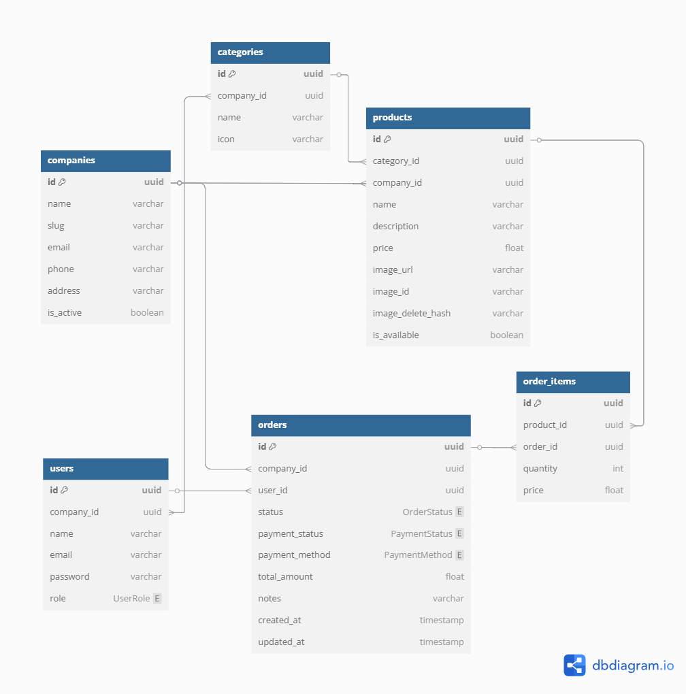

## 📚 Sumário

- [🧠 Decisões Técnicas](#-decisões-técnicas)
  - [🔄 ORM: Prisma](#-orm-prisma)
  - [🗃️ Armazenamento de Imagens: Cloudinary](#️-armazenamento-de-imagens-cloudinary)
  - [💾 Banco de Dados: PostgreSQL](#-banco-de-dados-postgresql)
  - [🧱 Estrutura Modular no NestJS](#-estrutura-modular-no-nestjs)
  - [🔐 Validação com Zod](#-validação-com-zod)
  - [🧪 Testes com Jest](#-testes-com-jest)
  - [⚙️ Integração Contínua com GitHub Actions](#️-integração-contínua-com-github-actions)
  - [📦 Gerenciador de Pacotes: Yarn v1](#-gerenciador-de-pacotes-yarn-v1)
  - [🔄 Comunicação em Tempo Real com WebSockets](#-comunicação-em-tempo-real-com-websockets)
  - [📐 Diagrama de Arquitetura](#-diagrama-de-arquitetura)
  - [🗄️ Diagrama ER do Banco de Dados](#️-diagrama-er-do-banco-de-dados)
  - [🎨 Protótipo Visual no Figma](#-protótipo-visual-no-figma)
  - [🔗 Teste as APIs no Postman](#-teste-as-apis-no-postman)

# 🧠 Decisões Técnicas

## 🔄 ORM: Prisma

**✅ Escolhido: Prisma**
-   Tipagem automática e forte integração com TypeScript
-   IntelliSense baseado no schema (autocompletar inteligente)  
-   Migrations previsíveis, versionadas e fáceis de aplicar  
-   Geração automática de tipos com base no banco   
-   Queries mais claras e fáceis de compor   

----------

## 🗃️ Armazenamento de Imagens: Cloudinary

**✅ Escolhido: Cloudinary**
- Solução completa de gerenciamento e otimização de imagens na nuvem
- CDN global integrada para entrega rápida e eficiente
- URLs públicas diretas para uso imediato sem necessidade de servidor intermediário
- Armazenamento persistente mesmo em ambientes efêmeros
- Identificador para exclusão: public_id
    - Cada imagem enviada recebe um public_id único, que deve ser armazenado no banco de dados
    - O public_id é usado para excluir a imagem via API do Cloudinary com segurança
- API oficial e SDKs facilitam upload, transformação e exclusão 

----------

## 💾 Banco de Dados: PostgreSQL

**✅ Escolhido: PostgreSQL (via Docker no dev e Neon em produção)**
-   Relacional, maduro e amplamente utilizado    
-   Compatível com Prisma    
-   Neon oferece plano gratuito e bom desempenho    
-   Dispensa configuração local fora do container    

----------

## 🧱 Estrutura Modular no NestJS

**✅ Escolhido: Feature Modules (Modular Monolith)**
-   Cada domínio tem seu próprio módulo: `orders`, `users`, `products`, etc.    
-   Facilita testes, organização e manutenção    
-   Prepara terreno para possível transição para microserviços no futuro
    
----------

## 🔐 Validação com Zod

**✅ Escolhido: Zod**
-   Validação funcional e fortemente tipada    
-   Permite composição de regras com `refine`, `merge`, `optional`, etc.    
-   Fácil integração com rotas, testes e regras de negócios    
-   Reutilização de schemas entre camadas   

----------

## 🧪 Testes com Jest

**✅ Escolhido: Jest**
-   Suporte oficial pelo NestJS   
-   Mocks integrados (`jest.fn()`, `jest.mock`)   
-   Cobertura (`test:cov`) e execução contínua (`test:watch`)   
-   Compatível com CI no GitHub Actions   

----------

## ⚙️ Integração Contínua com GitHub Actions

**✅ Escolhido: GitHub Actions**
-   Automatiza lint, testes e formatação  
-   Verifica todos os PRs automaticamente   
-   Configuração simples e eficiente   
-   Gratuito para repositórios públicos   

----------

## 📦 Gerenciador de Pacotes: Yarn v1

**✅ Escolhido: Yarn 1.22.x**
-   Lockfile mais estável que o NPM  
-   Compatível com `--frozen-lockfile` no CI   
-   Boa performance no uso local e em automações   
-   Amplamente adotado na comunidade NestJS/Prisma   

----------

## 🔄 Comunicação em Tempo Real com WebSockets

**✅ Escolhido: Socket.IO com NestJS**
-   Comunicação bidirecional em tempo real   
-   Integração fácil com `@WebSocketGateway()`   
-   Suporte a autenticação, salas, namespaces   
-   Ideal para notificações de cozinha/garçom

----------

## 📐 Diagrama de Arquitetura

*Descrição:*  
Este diagrama mostra a arquitetura geral do sistema, destacando os principais componentes:  
- Frontend Web (Next.js) para administração  
- Aplicativo Mobile (React Native) para garçons  
- Backend API (NestJS) responsável pela lógica, autenticação, e comunicação  
- Banco de Dados PostgreSQL (Neon em produção)  
- Comunicação em tempo real via WebSockets (Socket.IO)  

---

## 🗄️ Diagrama ER do Banco de Dados

*Descrição:*  
O modelo ER representa as principais entidades do sistema, seus atributos e relacionamentos, como:  
- Empresas  
- Usuários (Administradores, Garçons)  
- Produtos e Categorias  
- Pedidos e Itens de Pedido  

---

## 🎨 Protótipo Visual no Figma

Confira o design completo e interativo do sistema:  
[Figma - Sistema de Pedidos para Restaurantes](https://www.figma.com/design/YAr3wicRLZ3d2O1qsSpumx/TCC?node-id=4-2115&p=f&t=XDfy5W9rPz0hCYYt-0)

---

## 🔗 Teste as APIs no Postman

Você pode importar a coleção do Postman para testar todas as rotas do backend:  
- Link para a coleção online: [Postman Collection - Sistema de Pedidos](https://.postman.co/workspace/My-Workspace~a7375743-ff45-4ee3-8e91-f4969d0f1bb0/collection/40172076-bc619bf4-a4c0-43a9-a2d2-325d729dda0f?action=share&creator=40172076&active-environment=40172076-06fda899-0df7-49d1-bfb3-db8660b595af)  
- Ou baixe o arquivo JSON da coleção aqui: [docs/postman/SistemaPedidosCollection.json](./postman/collection.json)  

---

> **Dica:** Para usar a collection no Postman, importe o arquivo JSON no app e configure a variável de ambiente `base_url` apontando para a URL da sua API local ou de produção.
