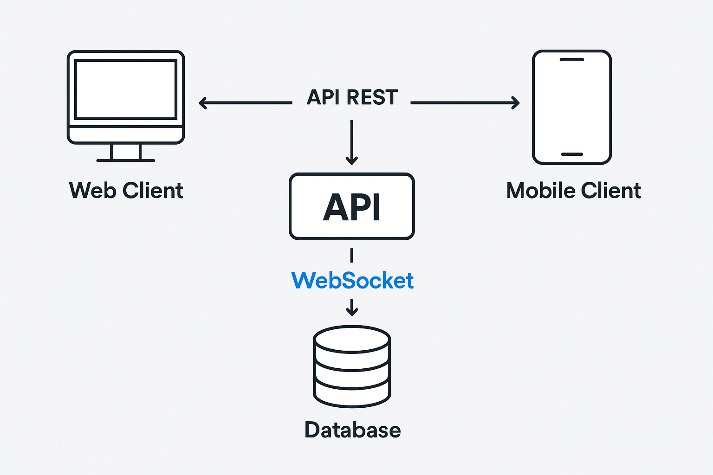

# 📊 Diagramas de Apoio e Manual de Uso

Este documento reúne os principais diagramas e materiais visuais utilizados para representar a arquitetura, o funcionamento e a navegação da aplicação desenvolvida no projeto de TCC.

---

## 🧱 1. Diagrama de Arquitetura de Software

Este projeto adota o padrão de arquitetura **client-server**, onde o backend (servidor) é responsável pelo processamento de dados, regras de negócio e persistência, enquanto o frontend (cliente) se comunica com ele para enviar e receber informações.

 

Abaixo está a descrição detalhada da estrutura e das conexões:

### 🧠 **Backend (NestJS + Prisma ORM)**

O backend foi implementado com **NestJS**, um framework Node.js que adota princípios do padrão arquitetural **modular e orientado a camadas**.

-   **Camadas**:
    
    -   **Controller**: recebe as requisições HTTP ou eventos do WebSocket.
        
    -   **Service**: contém as regras de negócio.
        
    -   **Repository (Prisma)**: responsável pelo acesso ao banco de dados.
        
-   **Principais Módulos**:
    
    -   `AuthModule`: autenticação de usuários (admin e garçons).
        
    -   `UsersModule`: gestão de usuários.

	-   `CompaniesModule`: gerenciamento de empresas.
        
    -   `CategoriesModule`: gerenciamento de categorias.
        
    -   `ProductsModule`: cadastro e exibição de produtos.
        
    -   `OrdersModule`: criação e atualização de pedidos.
        
    -   `OrderItemsModule`: controle dos itens de cada pedido.
        
-   **Integrações Externas**:
    
    -   **Cloudinary**: upload e armazenamento das imagens dos produtos.
        
    -   **PostgreSQL (via Prisma)**: banco de dados relacional (Neon DB) para armazenamento persistente.
        

----------

### 💻 **Frontend Web (Next.js)**

-   Desenvolvido com **Next.js + TypeScript**, utilizando **Tailwind CSS** para estilização e **Zustand** para gerenciamento de estado.
    
-   A interface permite o acesso restrito de administradores via login JWT.
    
-   Os administradores podem:
    
    -   Gerenciar produtos e categorias.
        
    -   Visualizar pedidos em tempo real (via **Socket.io**).
        
    -   Alterar o status dos pedidos (ex: de “pendente” para “em preparo”).
        
-   Conecta-se ao backend por meio de:
    
    -   **HTTP (Axios)** para CRUD de dados.
        
    -   **WebSocket** para receber atualizações dos pedidos em tempo real.
        

----------

### 📱 **Aplicativo Mobile (React Native)**

-   Interface simples e otimizada para garçons.
    
-   Permite login via JWT, listagem de produtos por categoria, criação de pedidos e visualização em tempo real.
    
-   Comunicação com o backend:
    
    -   **HTTP (Axios)** para login, criação de pedidos, e carregamento de produtos.
        
    -   **WebSocket (Socket.io)** para receber notificações em tempo real da cozinha sobre o status do pedido.
        

----------

### 🗃️ **Banco de Dados (PostgreSQL - Neon)**

-   Banco relacional hospedado no Neon.
    
-   Utiliza **Prisma ORM** para mapear os dados no backend com facilidade e segurança.
    
-   Tabelas principais: `users`, `categories`, `companies`, `products`, `orders`, `orderItems`.
    

----------

### ☁️ **Cloudinary (Upload de Imagens)**

-   O backend realiza upload de imagens via API Cloudinary.
    
-   Após o upload, salva-se no banco a `url`, `publicId` e `deleteHash`.
    
-   As imagens são renderizadas no frontend a partir dessas URLs.

---

## 🗃️ 2. Diagrama ER (Entidade-Relacionamento)

Apresenta a estrutura lógica do banco de dados, evidenciando as entidades, seus relacionamentos e atributos relevantes para o funcionamento da aplicação.

---

## 🔁 3. Fluxo de Funcionamento do Sistema

Abaixo estão descritos os principais caminhos de uso do sistema, simulando os passos tomados pelos usuários e o comportamento esperado da aplicação em resposta. Os fluxos cobrem tanto a interface administrativa (web) quanto o aplicativo mobile utilizado pelos garçons.

----------

### 👨‍💼 Fluxo de Administração (Web)

#### 🔐 Acesso

1.  **Admin abre a aplicação web.**
    
2.  **Tela de login é exibida.**
    
3.  Admin informa e-mail e senha.
    
4.  O sistema verifica as credenciais (requisição via API).
    
    -   Se **válidas**, redireciona para o **Dashboard de Administração**.
        
    -   Se **inválidas**, exibe mensagem de erro.
        

#### 📦 Cadastro de Produto

1.  Admin acessa a seção **"Produtos"**.
    
2.  Clica em **“Novo Produto”**.
    
3.  Preenche nome, descrição, preço, seleciona categoria e escolhe uma imagem.
    
4.  A imagem é enviada para o **Cloudinary**.
    
5.  A URL da imagem e os dados do produto são enviados para a API.
    
6.  O produto é salvo no banco de dados (Neon via Prisma).
    
7.  Mensagem de sucesso é exibida.
    

#### 📋 Gerenciamento de Pedidos

1.  Admin acessa a seção **“Pedidos”**.
    
2.  Visualiza a lista de pedidos **em tempo real**.
    
3.  Pode **atualizar o status** de cada pedido (ex: de “Pendente” para “Preparando”).
    
4.  O status atualizado é enviado via **WebSocket** para todos os clientes conectados.
    

----------

### 🍽️ Fluxo do Garçom (Mobile)

#### 🔐 Acesso

1.  Garçom abre o aplicativo mobile.
    
2.  Tela de login é exibida.
    
3.  Informa suas credenciais.
    
4.  O app envia os dados via HTTP para a API.
    
    -   Se as credenciais forem **válidas**, o garçom é autenticado.
        
    -   Token JWT é salvo localmente.
        
    -   Redireciona para a tela principal.
        

#### 🧾 Criar Pedido

1.  App exibe **lista de categorias**.
    
2.  Garçom escolhe uma categoria.
    
3.  São listados os produtos associados.
    
4.  Seleciona um ou mais produtos.
    
5.  Define quantidades e revisa o pedido.
    
6.  Clica em **“Enviar Pedido”**.
    
7.  O pedido é enviado para o backend via HTTP e **também emitido via WebSocket**.
    
8.  A cozinha (interface web) recebe o novo pedido em tempo real.
    

#### ⏱️ Acompanhamento do Pedido

1.  App exibe lista de pedidos em andamento.
    
2.  Quando o status de um pedido muda no backend, o app é **notificado via WebSocket**.
    
3.  A tela do garçom atualiza automaticamente com o novo status.
    

----------

### 🔁 Lógicas de Repetição e Decisões Comuns

-   **Login válido?**
    
    -   Sim → Redireciona
        
    -   Não → Exibe erro
        
-   **Adicionar mais itens ao pedido?**
    
    -   Sim → Volta para categorias
        
    -   Não → Prossegue para revisão e envio
        
-   **Pedido enviado com sucesso?**
    
    -   Sim → Mostra feedback e zera carrinho
        
    -   Não → Mostra erro

---

## 📘 4. Manual de Uso da Aplicação

Guia simplificado para navegação e apresentação do sistema nas interfaces web e mobile.

### 👨‍💻 Acesso Web (Administrador)

- Login via tela inicial com e-mail e senha
- Cadastro de categorias e produtos
- Acompanhamento em tempo real dos pedidos recebidos
- Alteração do status de pedidos conforme preparo

### 📱 Aplicativo Mobile (Garçom)

- Login com credenciais cadastradas
- Visualização de produtos por categoria
- Criação de pedidos com múltiplos itens
- Envio automático dos pedidos para a cozinha

---

## ✅ Considerações Finais

Esses materiais complementam a documentação técnica do projeto, contribuindo para a compreensão de sua estrutura e usabilidade tanto em termos de código quanto de experiência do usuário.